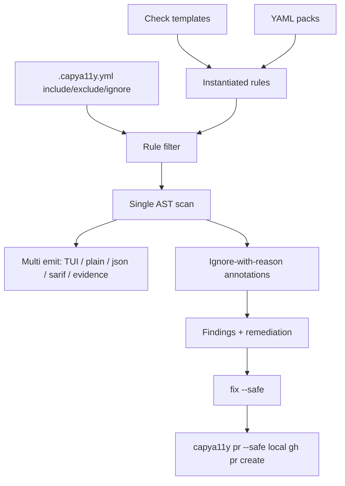

# CapyA11y: kube-linter-style hardening (no GitHub Actions)

## Overview

Adopt kube-linter product patterns into CapyA11y—templates/parameterized checks, include/exclude governance, ignore-with-reason, multi-format single scan, rules catalog CLI, first-class remediation, and optional local Fix-PR CLI—explicitly excluding GitHub Actions work.

## Scope

**In:** governance config, rule engine shape, CLI DX, finding schema, local Fix-PR command, docs/pre-commit, light ACR evidence polish.

**Out:** new GitHub Actions, `capya11y-action`, Konflux task packaging, SARIF upload workflows (existing `.github/workflows/capya11y.yml` left alone).



## 1. Config governance (include / exclude / defaults)

Extend [`packages/core/src/schema.ts`](../../packages/core/src/schema.ts) `ConfigSchema` (kube-linter `checks:` analogue):

```yaml
# .capya11y.yml
packs: [wcag-core, patternfly-v6]
checks:
  doNotAutoAddDefaults: false   # if true, only `include` runs
  include: []                   # optional allowlist of rule ids
  exclude: [pf-is-aria-disabled]
```

- Apply filter in [`load-rules.ts`](../../packages/core/src/load-rules.ts) / [`scan.ts`](../../packages/core/src/scan.ts) after packs load: `exclude` wins over `include` (kube-linter semantics).
- CLI: `--include`, `--exclude`, `--do-not-auto-add-defaults`.
- Update [`writeDefaultConfig`](../../packages/core/src/config.ts) + [rule-authoring.md](../rule-authoring.md).

## 2. Ignore-with-reason (audit trail)

Support suppressions that **require a reason** (kube-linter annotation pattern):

1. **File-level config** in `.capya11y.yml`:

```yaml
ignoreRules:
  - ruleId: pf-is-aria-disabled
    paths: ["**/LegacyConsole.tsx"]
    reason: "Privileged console cannot use isAriaDisabled yet — tracked RHACOMMON-123"
```

2. **Source comments** (preferred for local exceptions):

```tsx
// capya11y-ignore pf-is-aria-disabled -- Privileged console; RHACOMMON-123
<Button isDisabled>...</Button>
```

- Parser: nearest preceding comment within N lines of the JSX node; reason after `--` mandatory or finding stays.
- Suppressed findings appear in evidence/report under “Accepted exceptions” (not silent drop) — VPAT-friendly.
- Implement in [`match.ts`](../../packages/core/src/match.ts) / new `suppressions.ts`; wire into scan pipeline.

## 3. Templates + parameterized checks

Introduce kube-linter-style **templates** so a11y leads instantiate rules without new matcher code.

- New area: `packages/core/src/templates/` with built-in templates mapped to existing detect helpers, e.g.:
  - `missing-prop` → `missingProps` / `addProp`
  - `icon-only-name` → `noVisibleText` + `missingAnyOfProps` + suggest `aria-label`
  - `toast-live-region` → `toastWithoutLiveRegion` + safe `isLiveRegion`
  - `unlabeled-control` → existing unlabeled heuristics
- Check YAML may use either today’s full `detect`/`fix` **or**:

```yaml
id: pf-button-icon-only-name
template: icon-only-name
params:
  component: Button
  from: "@patternfly/react-core"
```

- Expand `RuleSchema` with optional `template` + `params`; resolve to concrete `Rule` at load time.
- Migrate 3–5 existing PF rules to templates as proof; leave others as-is for compatibility.
- Document in [rule-authoring.md](../rule-authoring.md) with a templates catalog.

## 4. First-class `remediation` on findings

kube-linter always pairs `(check, remediation)`.

- Add `remediation: string` to rule YAML (default from `fix` description / short `education` line).
- Add `remediation` to `Finding`; surface in plain, SARIF help, evidence, Ink `FindingRow`, `explain`.
- Ensures Fix-PR body and ACR narratives share one string.

## 5. Multi-format, single scan

Today: one format per run. Target (kube-linter multi `--format`/`--output`):

```bash
capya11y scan ./src \
  --format plain \
  --format sarif --out capya11y.sarif \
  --format evidence --out evidence.md
```

- Extend [`parse-args.ts`](../../packages/cli/src/parse-args.ts): repeatable `--format` + paired `--out` (or `--format sarif:path`).
- [`bin.tsx`](../../packages/cli/src/bin.tsx): run `scan` once; emit each format.
- Keep backward-compatible single `--json` / `--sarif` / `--evidence` / `--out`.

## 6. Catalog CLI: `rules list` / `packs list`

```bash
capya11y rules list [--pack patternfly-v6] [--json]
capya11y packs list [--json]
```

- Reuse `loadPacks` + `pack.json` manifests.
- Columns: id, pack, severity, autofix, wcag, template (if any).
- Ink table for TTY; plain/json otherwise.

## 7. Local Fix-PR command (not a GitHub Action)

Address Drive MOAT “auto PR” without Actions:

```bash
capya11y pr [path] --safe [--dry-run] [--title "..."]
```

Flow:

1. `scan` → `applyFixes({ mode: 'safe' })` (refuse if dirty git unless `--allow-dirty`).
2. `git checkout -b capya11y/fix-<timestamp>` (or use current branch with flag).
3. Stage only touched files; commit with conventional message.
4. If `gh` available: `gh pr create` with body from evidence summary + remediation list; else print push/PR instructions.
5. `--dry-run`: show branch/commit/PR body without mutating.

Implement as `packages/cli/src/commands/pr.ts` using `child_process` + existing core APIs. Document that Konflux/CI can call the same CLI later—no Action in this plan.

## 8. Pre-commit / local shift-left docs

- Add [docs/pre-commit.md](../pre-commit.md) with a sample `.pre-commit-config.yaml` / husky snippet: `capya11y scan --fail-on error --plain`.
- Link from README; no Action work.

## 9. VPAT / ACR narrative polish (docs + report fields)

Light enhancement to [`evidence.ts`](../../packages/core/src/evidence.ts):

- Optional “ACR-oriented” section: group by WCAG with placeholder Support columns (`Supports` / `Partially Supports` / `Does Not Support` / `Not Evaluated`) derived from finding counts, with a clear static-analysis disclaimer.
- Sample excerpt in [ci-and-evidence.md](../ci-and-evidence.md) for hackathon judges.

## Implementation order

1. Config include/exclude + CLI flags + tests
2. `remediation` field on rules/findings + report surfaces
3. Ignore-with-reason (config + comments) + evidence “Accepted exceptions”
4. Multi-format single scan
5. `rules list` / `packs list`
6. Templates + migrate a handful of rules
7. `capya11y pr` local Fix-PR
8. Pre-commit + ACR docs polish

## Success criteria

- Portfolio team can ship `.capya11y.yml` with exclude list and documented ignores (no silent drops).
- A11y lead adds a parameterized check via `template:` without touching TypeScript matchers.
- One `scan` produces SARIF + evidence without rescanning.
- `capya11y rules list` shows the full catalog.
- `capya11y pr --safe --dry-run` prints a ready PR title/body; live mode opens a PR via `gh` when installed.
- No new GitHub Actions artifacts in this workstream.

## Todos

| ID | Task |
|----|------|
| config-include-exclude | Add checks.include/exclude/doNotAutoAddDefaults to config + CLI + filter in load/scan |
| remediation-field | Add remediation to Rule/Finding and all report surfaces |
| ignore-with-reason | ignoreRules config + capya11y-ignore comments; Accepted exceptions in evidence |
| multi-format-scan | Repeatable --format/--out; single scan, multiple emitters |
| rules-packs-list | capya11y rules list and packs list (TTY + json) |
| templates | Template registry + template/params in RuleSchema; migrate 3–5 PF rules |
| local-fix-pr | capya11y pr --safe local branch/commit/gh pr create (no GitHub Action) |
| docs-precommit-acr | pre-commit docs + ACR-oriented evidence section/disclaimer |
